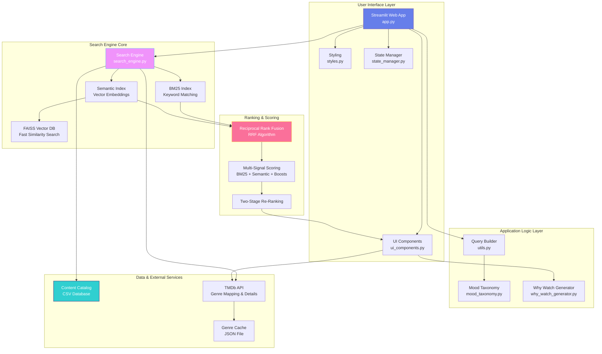
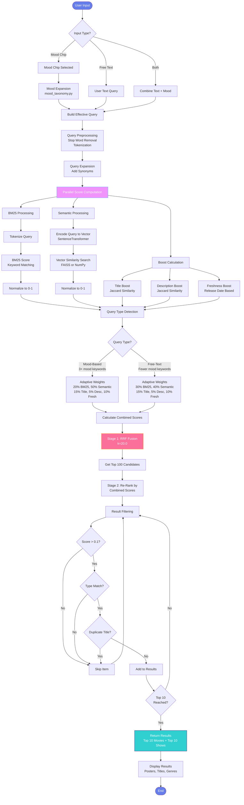
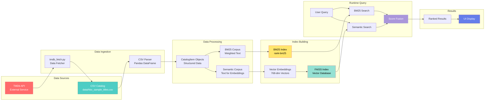
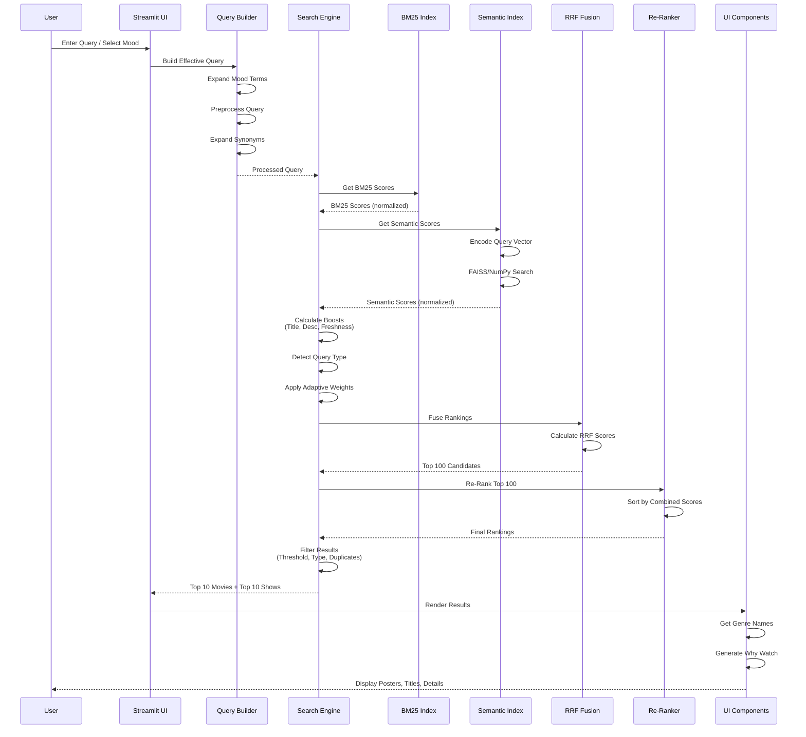
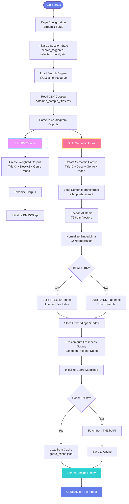
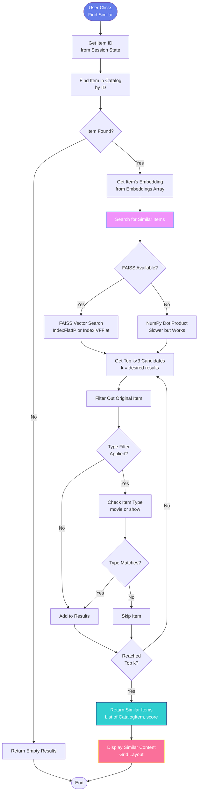
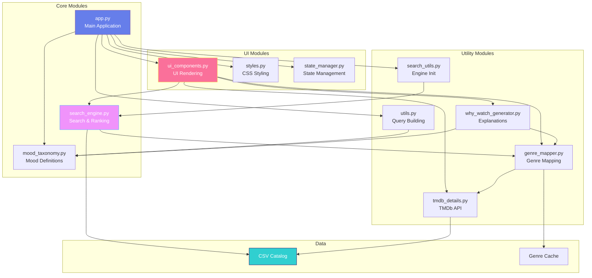

# Architecture Diagrams - Mood-Based Recommendation System

## 1. High-Level System Architecture



## 2. Detailed Query Processing Flow



## 3. Data Flow Architecture



## 4. Component Interaction Sequence



## 5. Scoring Algorithm Flow

```mermaid
flowchart TD
    START([Query Input]) --> PREP[Preprocess & Expand Query]
    
    PREP --> BM25[BM25 Score Calculation]
    PREP --> SEM[Semantic Score Calculation]
    PREP --> BOOSTS[Boost Calculations]
    
    BM25 --> BM25_NORM[Normalize BM25<br/>Range: 0-1]
    
    SEM --> SEM_ENCODE[Encode to 768-dim Vector]
    SEM_ENCODE --> SEM_SIM[Cosine Similarity Search]
    SEM_SIM --> SEM_NORM[Normalize Semantic<br/>Range: 0-1]
    
    BOOSTS --> TITLE[Title Boost<br/>Jaccard Similarity<br/>+0.3 for exact phrase]
    BOOSTS --> DESC[Description Boost<br/>Jaccard Similarity × 0.5]
    BOOSTS --> FRESH[Freshness Boost<br/>Based on Release Date]
    
    BM25_NORM --> DETECT[Query Type Detection]
    SEM_NORM --> DETECT
    TITLE --> DETECT
    DESC --> DETECT
    FRESH --> DETECT
    
    DETECT --> CHECK{3+ Mood Keywords<br/>OR 5+ Words?}
    
    CHECK -->|Yes| MOOD_WEIGHTS[Mood-Based Weights<br/>20% BM25<br/>50% Semantic<br/>15% Title<br/>5% Description<br/>10% Freshness]
    
    CHECK -->|No| TEXT_WEIGHTS[Free-Text Weights<br/>30% BM25<br/>40% Semantic<br/>15% Title<br/>5% Description<br/>10% Freshness]
    
    MOOD_WEIGHTS --> COMBINE[Weighted Combination<br/>Final Score = Σ(weight × score)]
    TEXT_WEIGHTS --> COMBINE
    
    COMBINE --> RRF[RRF Fusion<br/>k=20.0]
    
    RRF --> RANK1[Rank by BM25]
    RRF --> RANK2[Rank by Semantic]
    RANK1 --> RRF_CALC[RRF Score = Σ(1/(k+rank+1))]
    RANK2 --> RRF_CALC
    
    RRF_CALC --> TOP100[Get Top 100 by RRF]
    TOP100 --> RERANK[Re-Rank by Combined Scores]
    
    RERANK --> FILTER[Filter Results]
    FILTER --> THRESHOLD{Score ≥ 0.1?}
    THRESHOLD -->|No| SKIP[Skip]
    THRESHOLD -->|Yes| TYPE{Type Match?}
    
    TYPE -->|No| SKIP
    TYPE -->|Yes| DUP{Duplicate?}
    
    DUP -->|Yes| SKIP
    DUP -->|No| RESULT[Add to Results]
    
    RESULT --> TOPK{Top 10?}
    TOPK -->|No| FILTER
    TOPK -->|Yes| OUTPUT([Final Results])
    
    SKIP --> FILTER
    
    style START fill:#667eea,stroke:#764ba2,color:#fff
    style COMBINE fill:#f093fb,stroke:#4facfe,color:#fff
    style RRF fill:#fa709a,stroke:#fee140,color:#fff
    style OUTPUT fill:#30cfd0,stroke:#330867,color:#fff
```

## 6. System Initialization Flow



## 7. Similar Content Discovery Flow



## 8. Module Dependency Graph



## Usage Instructions

These Mermaid diagrams can be used in:
- **Markdown documentation** (GitHub, GitLab, etc.)
- **Documentation sites** (MkDocs, Sphinx, etc.)
- **Thesis papers** (with appropriate Mermaid renderer)
- **Presentation slides** (exported as images)
- **Online tools** (Mermaid Live Editor: https://mermaid.live)

### Rendering Options:
1. **Online**: Copy diagram code to https://mermaid.live
2. **VS Code**: Install "Markdown Preview Mermaid Support" extension
3. **GitHub/GitLab**: Native Mermaid support in markdown files
4. **Export**: Use Mermaid CLI to export as PNG/SVG

### Diagram Types Included:
1. **High-Level Architecture**: System overview
2. **Query Processing Flow**: Detailed step-by-step flow
3. **Data Flow**: Data movement through system
4. **Sequence Diagram**: Component interactions
5. **Scoring Algorithm**: Scoring calculation flow
6. **Initialization Flow**: System startup process
7. **Similar Content Flow**: Similar item discovery
8. **Module Dependencies**: Code structure

